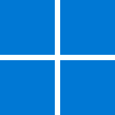

# Learn LWJGL

Python
-  [Site Oficial](https://www.python.org/)
<br><br>

PyOpenGL
-  [pypi.org](https://pypi.org/project/PyOpenGL/)

LearnOpenGL
-  [Site Oficial](https://learnopengl.com/)
-  [GitHub](https://github.com/JoeyDeVries/LearnOpenGL)
<br><br>

download-directory • github • io
-  [Site Oficial](https://download-directory.github.io/)
<br><br>

##  Python

 Linux
```xml
sudo apt update
```
```xml
sudo apt install python3
```
```xml
python3 --version
```
```xml
sudo apt install python3-pip
```
```xml
pip list
```
```xml
sudo apt install python3.12-venv
```
```xml
rm -rf .git
```
```xml
python3 -m venv .venv
```
```xml
source .venv/bin/activate
```
```xml
pip install PyOpenGL PyOpenGL_accelerate
```
```xml
pip install glfw
```
```xml
pip install numpy
```
```xml
pip install Pillow
```
```xml
pip install PyGLM
```
```xml
python3 src/main.py
```
<br><br>

##  VSCode
- [VSCode - Site Oficial](https://code.visualstudio.com/)
<br><br>

 Linux
```xml
code .
```
```xml
clear
```
<br>

 Windows
```xml
cls
```
<br>

Extensões Uteis
-  [Portuguese (Brazil) Language Pack for Visual Studio Code](https://marketplace.visualstudio.com/items?itemName=MS-CEINTL.vscode-language-pack-pt-BR)
-  [Material Icon Theme](https://marketplace.visualstudio.com/items?itemName=PKief.material-icon-theme)
-  [Python](https://marketplace.visualstudio.com/items?itemName=ms-python.python)
-  [GLSL Syntax for VS Code](https://marketplace.visualstudio.com/items?itemName=GeForceLegend.vscode-glsl)
<br><br>
